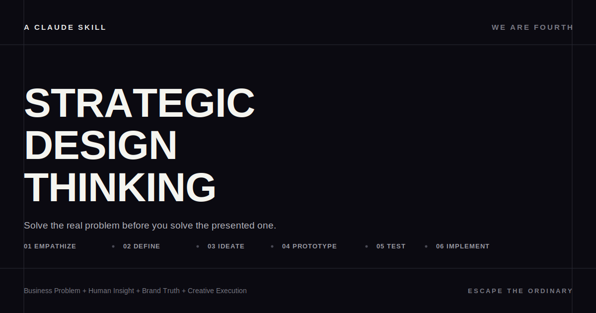

# Claude Skills for Designers

A collection of Claude skills built for creative and design work.

## Skills

### [Strategic Design Thinking](strategic-design-thinking/)

Turns vague briefs and business challenges into structured Strategic Design Thinking outputs — Empathize, Define, Ideate, Prototype, Test, Implement — so every solution solves the real problem, not just the one that was asked. [Read more →](strategic-design-thinking/README.md)

---

## Using a skill

Download the `SKILL.md` (and any `assets/` it includes) from the relevant folder above and add it to your Claude skills directory, or point Claude directly at this repo.
